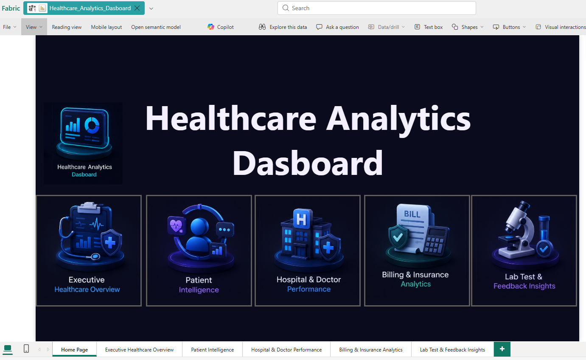
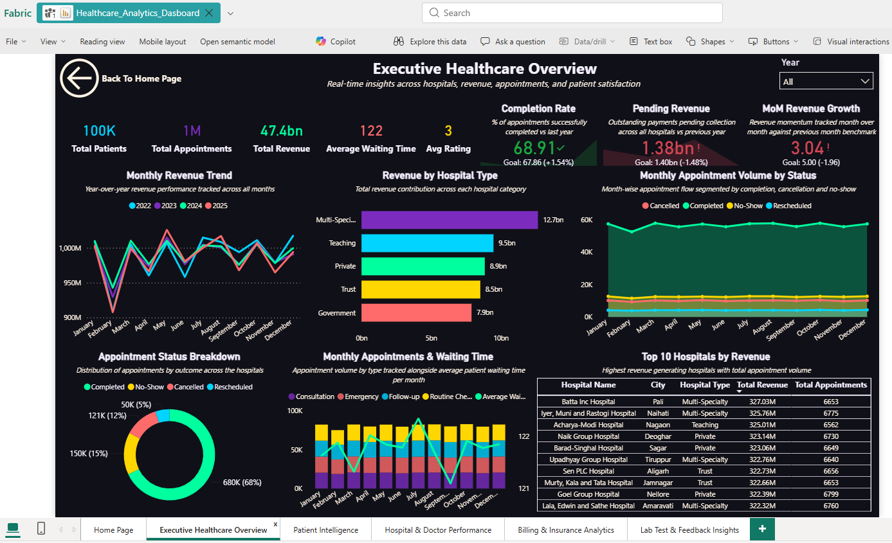
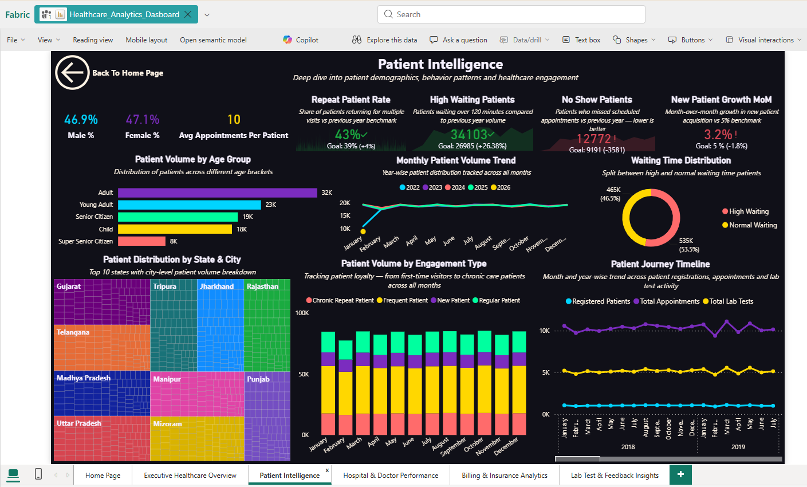
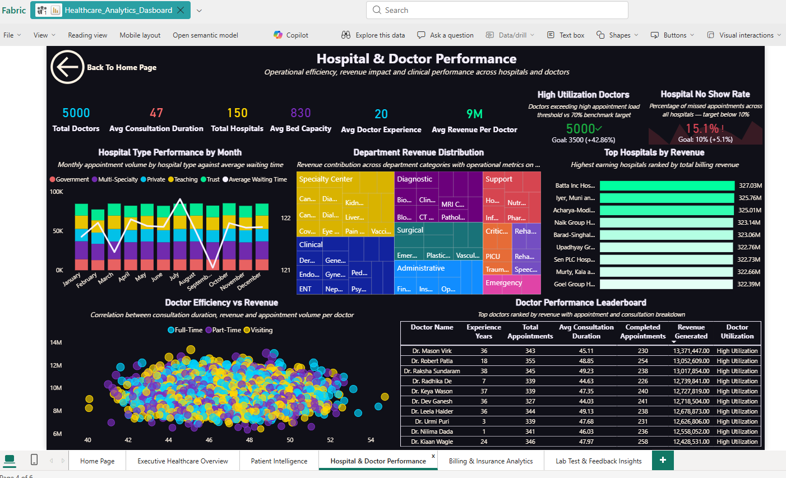
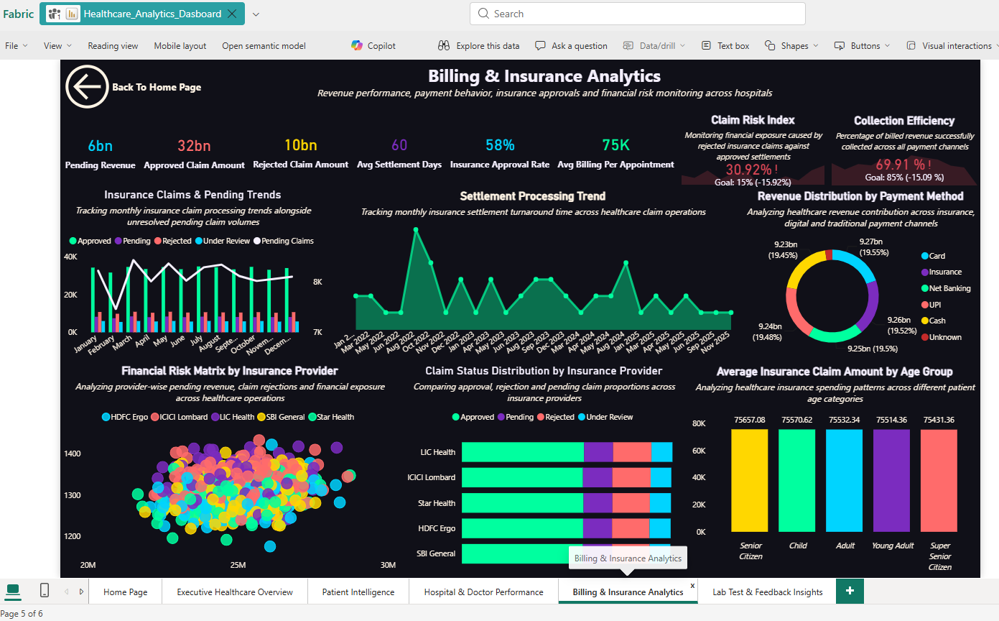
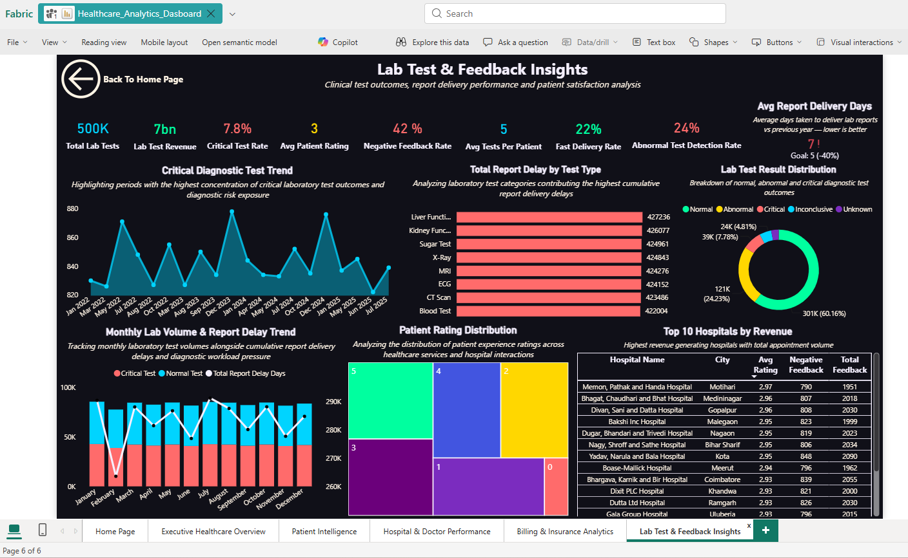
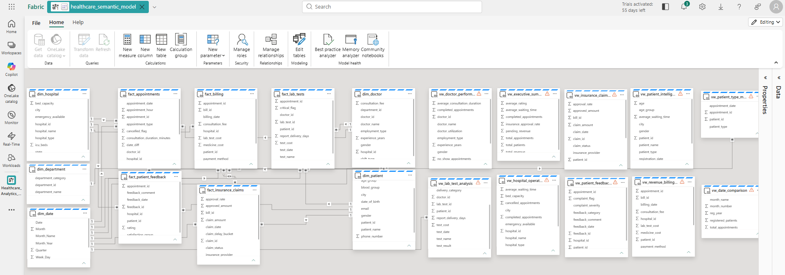
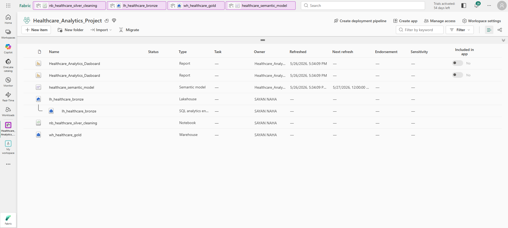

# 🏥 Healthcare Analytics Platform

An end-to-end Healthcare Analytics solution built using:

**Microsoft Fabric → Lakehouse → PySpark → SQL Warehouse → Semantic Model → Power BI**

---

## 🔗 Live Dashboard

👉 (Add your Power BI Service link here)

[View Dashboard](YOUR_POWER_BI_LINK_HERE)

---


---

# 📌 Project Overview

This project is a complete **Healthcare Analytics Platform** developed using Microsoft Fabric.

The goal of this project was to build an enterprise-style healthcare intelligence system capable of analyzing:

- Patient behavior
- Hospital operations
- Doctor performance
- Insurance & billing analytics
- Laboratory diagnostics
- Patient feedback & satisfaction

The project follows a modern **Medallion Architecture** approach using:

- Bronze Layer (Raw Data)
- Silver Layer (Cleaned Data)
- Gold Layer (Business Analytics)

The final solution delivers a multi-page executive Power BI dashboard for operational, financial, and clinical intelligence reporting.

---

# 🗂️ Project Workflow

```text
Raw CSV Data
      ↓
Lakehouse (Bronze Layer)
      ↓
Notebook / PySpark Cleaning (Silver Layer)
      ↓
Warehouse (Gold Layer)
      ↓
SQL Analytics Views
      ↓
Semantic Model
      ↓
Power BI Dashboard
```

---

# 🛤️ Project Architecture

(Add Architecture Diagram Here)

---

# 🛠️ Tools & Technologies

| Tool | Purpose |
|------|---------|
| Microsoft Fabric | End-to-end analytics platform |
| Lakehouse | Raw data ingestion & storage |
| PySpark Notebook | Data cleaning & transformation |
| SQL Warehouse | Gold layer analytics modeling |
| SQL | Fact tables, dimensions, views |
| Semantic Model | KPI & reporting layer |
| Power BI | Dashboard visualization |
| DAX | Business calculations & KPIs |

---

# 📁 Dataset

This project uses multiple healthcare datasets:

### Main Datasets
- Patient Data
- Appointment Data
- Hospital Data
- Billing Data
- Insurance Claims
- Lab Test Reports
- Patient Feedback Data

---

# 🔷 Step 1: Lakehouse (Bronze Layer)

## Lakehouse Used

```text
lh_healthcare_bronze
```

### What I Did
- Uploaded raw CSV datasets
- Stored healthcare source data
- Created bronze layer ingestion pipeline

### Raw Data Included
- Patients
- Appointments
- Billing
- Insurance Claims
- Lab Tests
- Patient Feedback

---

# 🟡 Step 2: Notebook / PySpark Transformation (Silver Layer)

## Notebook Used

```text
nb_healthcare_silver_cleaning
```

### What I Did in PySpark
- Cleaned raw healthcare datasets
- Removed duplicates
- Handled null values
- Standardized columns
- Performed data transformation
- Created analytics-ready cleaned datasets

### PySpark Operations
- Data ingestion
- Data cleaning
- Filtering
- Joins
- Transformation pipelines

### Output
Cleaned Silver Layer datasets ready for analytics processing.

---

# 🟠 Step 3: SQL Warehouse (Gold Layer)

## Warehouse Used

```text
wh_healthcare_gold
```

### What I Built
- Fact tables
- Dimension tables
- SQL analytics views
- Reporting-ready business models

---

# 🧱 Dimension Tables

- dim_patient
- dim_doctor
- dim_hospital
- dim_department
- dim_date

---

# 📦 Fact Tables

- fact_appointments
- fact_billing
- fact_insurance_claims
- fact_lab_tests
- fact_patient_feedback

---

# 🧮 SQL Views Created

- vw_patient_intelligence
- vw_doctor_performance
- vw_hospital_operations
- vw_executive_summary
- vw_lab_test_analysis
- vw_insurance_claim_analysis
- vw_revenue_billing_analysis
- vw_patient_feedback_analysis
- vw_date_comparison

---

# 🔵 Step 4: Semantic Model

## Semantic Model Used

```text
healthcare_semantic_model
```

### What I Did
- Created relationships between fact & dimension tables
- Built DAX measures
- Developed KPI calculations
- Designed reporting layer for Power BI

---

# 📊 DAX Measures

Some key measures created:

- Total Patients
- Total Revenue
- Avg Waiting Time
- Repeat Patient Rate
- Insurance Approval Rate
- Pending Revenue
- Avg Settlement Days
- Critical Test Rate
- Negative Feedback Rate
- Fast Delivery Rate

---

# 📈 Step 5: Power BI Dashboard

## Dashboard Name

```text
Healthcare_Analytics_Dashboard
```

The final dashboard contains 6 fully interactive pages designed for executive, operational, financial, and clinical healthcare analytics.

---

# 📊 Dashboard Pages

---

# 🟦 Page 1 — Home Page

### Purpose
Navigation and executive landing page for the healthcare analytics platform.

### Features
- Interactive page navigation
- Healthcare analytics branding
- Executive dashboard entry point

---

# 🟪 Page 2 — Executive Healthcare Overview

### Purpose
High-level operational and revenue overview across hospitals.

### Key KPIs
- Total Patients
- Total Appointments
- Total Revenue
- Avg Waiting Time
- Appointment Completion Rate
- Revenue Growth

### Key Insights
- Revenue trends across months
- Appointment volume tracking
- Hospital revenue distribution
- Operational performance monitoring

---

# 🟩 Page 3 — Patient Intelligence

### Purpose
Analyze patient demographics, engagement, and behavioral patterns.

### Key Insights
- Repeat patient analysis
- No-show patient monitoring
- Waiting time distribution
- Age group analysis
- Patient journey trends
- Engagement segmentation

---

# 🟨 Page 4 — Hospital & Doctor Performance

### Purpose
Monitor hospital operations and doctor efficiency.

### Key Insights
- Doctor utilization analysis
- Consultation duration tracking
- Department revenue contribution
- Hospital performance ranking
- Doctor leaderboard analytics

---

# 🟥 Page 5 — Billing & Insurance Analytics

### Purpose
Analyze healthcare revenue, claims, and insurance performance.

### Key Insights
- Pending revenue analysis
- Insurance approval trends
- Settlement delay monitoring
- Claim risk analysis
- Payment method distribution
- Financial exposure tracking

---

# 🟦 Page 6 — Lab Test & Feedback Insights

### Purpose
Track clinical diagnostics and patient satisfaction.

### Key Insights
- Critical diagnostic trends
- Report delivery delays
- Lab test result analysis
- Patient rating distribution
- Negative feedback monitoring
- Clinical operational intelligence

---

# 📸 Dashboard Preview

### 🔹 Home Page


### 🔹 Executive Healthcare Overview


### 🔹 Patient Intelligence


### 🔹 Hospital & Doctor Performance


### 🔹 Billing & Insurance Analytics


### 🔹 Lab Test & Feedback Insights


### 🔹 Healthcare Semantic Model


### 🔹 Microsoft Fabric Project Workspace.png


---

# 💡 Key Business Insights

- Patient no-show behavior impacts hospital operations
- Insurance claim delays create financial exposure
- Doctor utilization directly impacts operational efficiency
- Critical diagnostic trends require monitoring
- Negative patient feedback highlights service quality issues
- Revenue performance varies significantly across hospital types

---

# 🧠 Skills Demonstrated

- Microsoft Fabric
- Lakehouse Architecture
- Medallion Architecture
- PySpark Data Engineering
- SQL Warehouse Modeling
- Semantic Modeling
- DAX
- Power BI Dashboarding
- Healthcare Analytics
- Data Storytelling
- Business Intelligence

---

# ✅ Project Outcome

This project demonstrates a complete end-to-end enterprise healthcare analytics ecosystem built using Microsoft Fabric.

The solution helps healthcare organizations:

- Improve operational efficiency
- Monitor financial performance
- Analyze patient behavior
- Track clinical diagnostics
- Reduce operational risks
- Support data-driven decision-making

---

# 👨‍💻 About Me

## Sayan Naha

📧 Email: snsayan2012@gmail.com  
🔗 LinkedIn: (Add LinkedIn Profile Link Here)
